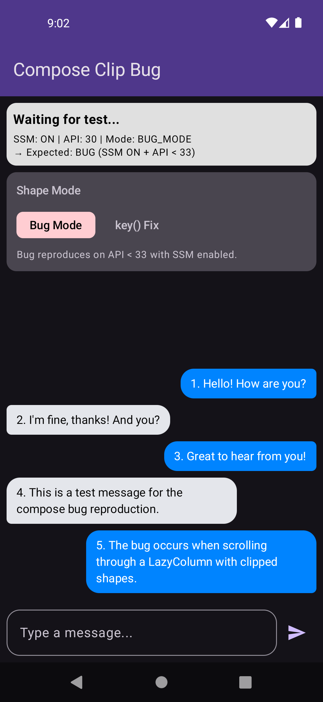
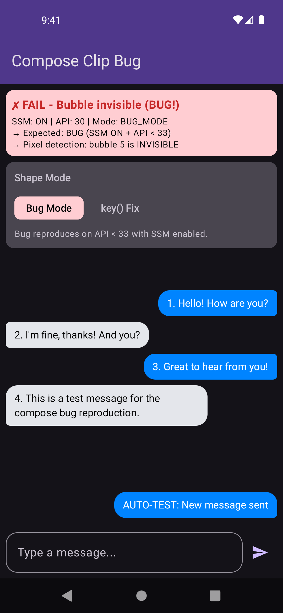

# Compose Clip Bug with Strong Skipping Mode

Minimal reproduction of Jetpack Compose clip bug on API < 33.

## The Bug

| Before (5 bubbles visible) | After sending message (bubble 5 invisible!) |
|----------------------------|---------------------------------------------|
|  |  |

**Bubble 5 disappears** after sending a new message. The bubble still exists in the composition tree but is visually invisible.

## Bug Summary

Message bubbles become **invisible** when:
- Strong Skipping Mode is enabled (default in Kotlin 2.0.20+)
- Using `Modifier.clip(shape)` with dynamic shape that changes
- Running on Android API < 33

## Environment

| Component | Version |
|-----------|---------|
| Compose UI | 1.7.6 / 1.8.2 / 1.10.0 (all affected) |
| Kotlin | 2.0.20+ (SSM enabled by default) |
| Affected API | < 33 (tested on API 30, 31, 32) |
| Works on | API 33+ (tested on API 33, 34, 35) |

## Quick Reproduction

```bash
# Build and install
./gradlew :app:installDebug

# Run on API 30-32 emulator
# 1. App shows 5 message bubbles
# 2. Click "Send" button
# 3. Bubble #5 becomes INVISIBLE (bug!)
```

## What Happens

1. Initial state: 5 message bubbles, bubble #5 is the last outgoing with `isLast=true`
2. Send new message: bubble #5 becomes NOT last (`isLast=false`), shape parameter changes
3. **Bug**: Instead of updating the shape, the bubble becomes completely invisible

## Root Cause Hypothesis

**Location:** `SimpleGraphicsLayerModifier.invalidateLayerBlock()` in [GraphicsLayerModifier.kt#837](https://android.googlesource.com/platform/frameworks/support/+/refs/heads/androidx-compose-release/compose/ui/ui/src/commonMain/kotlin/androidx/compose/ui/graphics/GraphicsLayerModifier.kt#837)

**Problem:** When SSM memoizes `layerBlock` lambda, `invalidateLayerBlock()` calls `updateLayerBlock(layerBlock)` without `forceUpdateLayerParameters = true`. Since the lambda reference is unchanged, `updateLayerParameters()` is skipped → outline not updated.

```kotlin
// Current (bug)
fun invalidateLayerBlock() = updateLayerBlock(layerBlock)

// Proposed fix
fun invalidateLayerBlock() = updateLayerBlock(layerBlock, forceUpdateLayerParameters = true)
```

**Note:** The public API `LayoutModifierNode.updateLayerBlock()` already uses `forceUpdateLayerParameters = true`, confirming this is the intended behavior when explicitly requesting invalidation.

**Why API < 33 only:** `Outline.canClip()` returns `false` for path-based outlines on API < 33, forcing software clipping via `canvas.clipPath()` which uses stale coordinates. On API 33+ ([AOSP change](https://android.googlesource.com/platform/frameworks/base/+/33c1ea73%5E%21/#F0)), `canClip()` returns `true` → hardware clipping doesn't depend on display list.

**Related:** [#374310082](https://issuetracker.google.com/issues/374310082) — identical mechanism (SSM + lambda memoization breaks invalidation).

## Workaround

Force composition recreation when shape changes:

```kotlin
key(System.identityHashCode(shape)) {
    Box(modifier = Modifier.clip(shape).background(color)) {
        content()
    }
}
```

The app includes a "key() Fix" mode that demonstrates this workaround.

## Project Structure

```
app/src/main/java/work/vkkovalev/samplecomposebug/
├── MainActivity.kt           # UI with mode selector (Bug Mode / key() Fix)
├── ChatScreen.kt             # LazyColumn + auto-test + pixel detection
├── MessageBubble.kt          # Modifier.clip(shape) - where bug manifests
├── MessageBubbleShapes.kt    # Singleton shapes with logging
├── MessageInput.kt           # TextField + Send button
└── Message.kt                # Data model
```

## Build Variants

| Variant | SSM | Use Case |
|---------|-----|----------|
| `debug` | ON | Bug reproduction |
| `release` | ON | Release build (minified) |
| `ssmOff` | OFF | Verify SSM is the trigger |

```bash
# Build with SSM ON (bug reproduces)
./gradlew :app:assembleDebug

# Build with SSM OFF (no bug)
./gradlew :app:assembleSsmOff
```

## Automated Test

```bash
# Run pixel-based bug detection test
./gradlew :app:connectedDebugAndroidTest
```

The test captures pixels at bubble location before and after sending a message. On API < 33 with SSM enabled, the test fails because the bubble has 0 visible pixels after the send.

## Reported Issue

**[#476791419](https://issuetracker.google.com/issues/476791419)** - Modifier.clip() content becomes invisible on API < 33 when shape changes with SSM enabled

## Related Issues

- [#374310082](https://issuetracker.google.com/issues/374310082) - SSM + lambda memoization breaks behavior
- [#340895237](https://issuetracker.google.com/issues/340895237) - graphicsLayer clip + lazy lists
- [#377733401](https://issuetracker.google.com/issues/377733401) - Dynamic shape + clip invisible
- [#348188145](https://issuetracker.google.com/issues/348188145) - LazyColumn blank spaces (partial fix)
- [#434149434](https://issuetracker.google.com/issues/434149434) - layerBlock lambda not triggering invalidation
